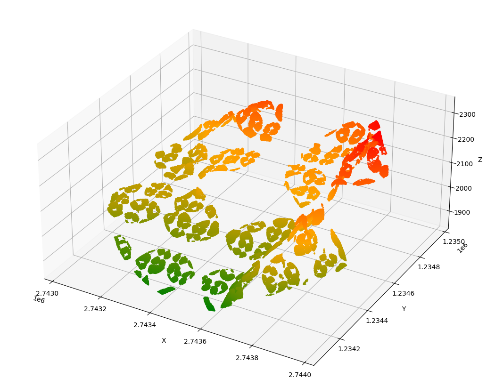

# Octree-based LAS File Visualization Project for Matom.ai

## Project Overview

This project implements an Octree-based point cloud visualization system for LAS (LiDAR) files. It uses a modified Octree data structure with embedded spheres to efficiently organize and render large point cloud datasets. The system supports level-of-detail (LOD) rendering and parallel processing for improved performance. 

## Key Components

### 1. main.py

This is the entry point of the application. It handles the following tasks:

- Loading LAS files using the `pylas` library
- Extracting point cloud data and boundaries
- Sampling points if the dataset is too large
- Creating an Octree structure from the point cloud
- Visualizing the points inside Octree spheres

### 2. octree.py

This file contains the core implementation of the Octree data structure and visualization logic:

#### Classes

1. `OctreeNode`:
   - Represents a single node in the Octree
   - Manages point insertion, subdivision, and sphere optimization
   - Implements point filtering based on spherical boundaries

2. `Octree`:
   - Manages the overall Octree structure
   - Handles point insertion and retrieval
   - Provides visualization methods

#### Key Features

- **Embedded Spheres**: Each Octree node contains a sphere that optimizes its position based on the contained points.
- **Level of Detail (LOD) Rendering**: Implements a camera-based LOD system for efficient rendering of large point clouds.
- **Parallel Processing**: Supports parallel point insertion for improved performance on multi-core systems.

## API Workflow

1. **LAS File Loading**: The application reads a LAS file using `pylas`.

2. **Point Cloud Processing**:
   - Extracts point coordinates (x, y, z) from the LAS data.
   - Determines the bounding box of the point cloud.
   - Samples points if the dataset exceeds a specified threshold.

3. **Octree Creation**:
   - Initializes the root Octree node with the point cloud boundaries.
   - Inserts points into the Octree structure, which recursively subdivides as needed.

4. **Sphere Optimization**:
   - Each Octree node optimizes its embedded sphere position based on the contained points.
   - This optimization improves the efficiency of point filtering and LOD rendering.

5. **Visualization**:
   - Uses Matplotlib to create a 3D scatter plot of the point cloud.
   - Implements a custom color scheme based on point elevation.
   - Supports LOD rendering based on camera position.

## Key Algorithms

### Point Insertion
- Points are recursively inserted into the Octree structure.
- Nodes subdivide when they exceed the maximum point capacity.
- Points are filtered based on both cubic and spherical boundaries.

### Sphere Optimization
- Calculates the mean position of points within a node.
- Adjusts the sphere center towards the mean position, constrained by node boundaries.
- Improves the efficiency of point filtering and LOD rendering.

### Level of Detail (LOD) Rendering
- Determines which points to render based on the distance from the camera.
- Uses a distance-based threshold to decide whether to render a node's points or descend to its children.

### Parallel Processing
- Divides the point cloud into chunks.
- Processes chunks in parallel using Python's `ProcessPoolExecutor`.

## Usage

1. Place your LAS file in the project directory.
2. Update the `las_file_path` in `main.py` to point to your LAS file.
3. Run `main.py` to process the LAS file and visualize the point cloud.

## Dependencies

- Python 3.x
- numpy
- pylas
- matplotlib
- concurrent.futures (standard library)

## Possible Future Improvements

1. Implement more advanced LOD techniques for smoother transitions.
2. Add support for different point attributes (e.g., intensity, classification).
3. Optimize memory usage for extremely large point clouds.
4. Implement a more interactive visualization system (e.g., using OpenGL or a web-based 3D renderer).
5. Add support for multiple LAS file processing and merging.
